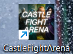
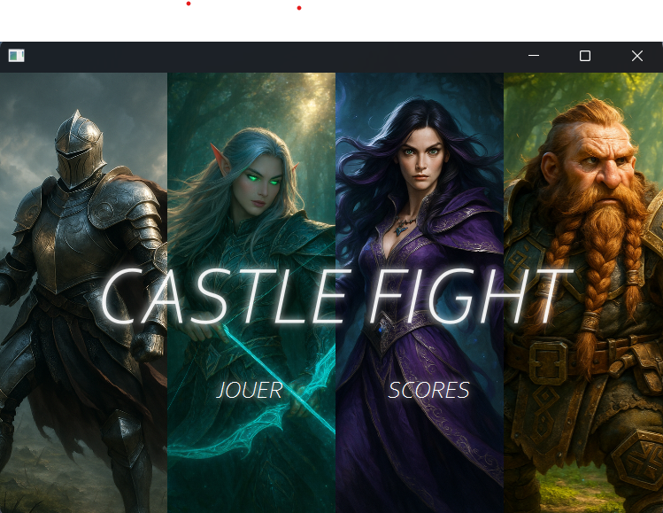
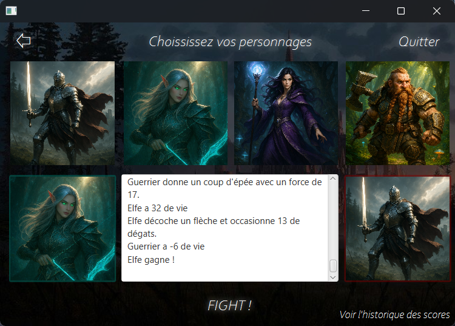
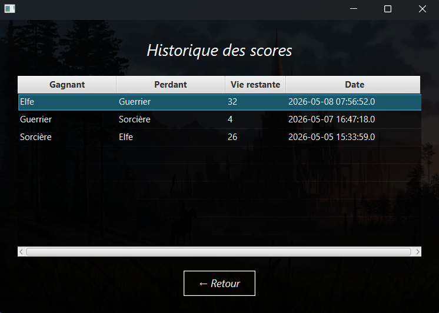
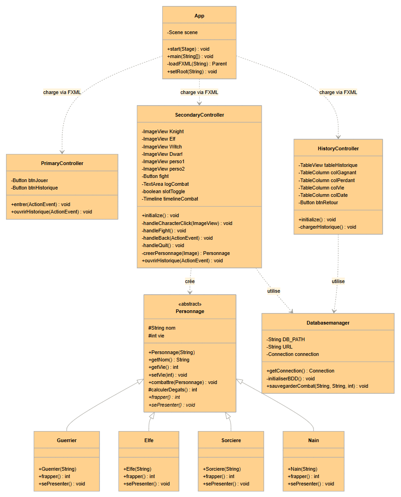

# CastleFightArena

Application desktop de simulation de combats médiévaux-fantastiques développée en Java/JavaFX.

L'utilisateur sélectionne deux personnages parmi quatre classes (Guerrier, Elfe, Sorcière, Nain), lance un combat automatique dont le déroulé s'affiche en temps réel, et peut consulter l'historique des combats sauvegardés en base de données.

## Technologies utilisées

- Java — langage principal du projet
- JavaFX — bibliothèque graphique pour l'interface utilisateur
- FXML — définition déclarative des interfaces graphiques
- Maven — gestion des dépendances et build du projet
- MySQL — persistance des résultats de combat en base de données distante (hébergée sur O2Switch)

## Prérequis

- Windows 10 ou supérieur
- Aucune installation de Java requise (inclus dans l'installateur)

## Installation (fichier .msi)

1. Télécharger le fichier `CastleFightArena.msi`
2. Double-cliquer sur le fichier `.msi` pour lancer l'installateur
3. Suivre les étapes de l'assistant d'installation
4. Une fois l'installation terminée, lancer l'application depuis le raccourci créé sur le bureau ou dans le menu Démarrer

_Si Windows affiche un avertissement "Application inconnue", cliquer sur "Informations complémentaires" puis "Exécuter quand même"._

## Configuration de la base de données

La base de données est hébergée sur O2Switch et est déjà configurée. Aucune action n'est requise, l'application s'y connecte automatiquement au démarrage.

## Guide d'utilisation

1. Lancer l'application
 Double-cliquer sur le raccourci "CastleFightArena" créé sur le bureau ou dans le menu Démarrer.

2. Accéder à l'arène
 Cliquer sur le bouton "Jouer" pour accéder à l'écran de sélection des personnages.

3. Choisir les combattants
 Cliquer sur un personnage pour le placer dans le slot 1, puis cliquer sur un second personnage pour le slot 2.
 Les quatre classes disponibles sont : Guerrier, Elfe, Sorcière, Nain.

4. Lancer le combat
 Cliquer sur le bouton "Fight !". Le déroulé du combat s'affiche progressivement dans le journal de combat.

5. Consulter l'historique
 Cliquer sur le bouton "Voir l'historique des scores" pour accéder à la liste des combats précédents avec le gagnant, le perdant et les points de vie restants.

## Diagramme de classes

